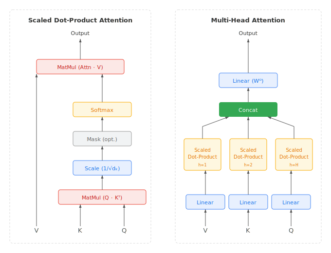

## TL;DR

Multi-Head Attention (MHA) is the original attention mechanism from the Transformer. It projects input into multiple independent query/key/value heads, computes scaled dot-product attention in parallel, and concatenates the results. Simple and effective, but its per-head KV cache grows linearly with sequence length, motivating the variants that follow.

## Motivation

Before the Transformer, sequence models were dominated by RNNs and LSTMs.
These process tokens one at a time, maintaining a hidden state that carries
information forward. The bottleneck: each token must wait for the previous
one to finish. Long sequences suffer from vanishing gradients and
fundamentally sequential computation that cannot be parallelized.

Bahdanau et al. [[2]](#ref-2) introduced *attention* as an add-on to
sequence-to-sequence models — letting the decoder look back at all encoder
states instead of compressing everything into a fixed vector. This was
powerful but still sat on top of a recurrent backbone.

Vaswani et al. [[1]](#ref-1) asked: what if attention is *all* you need?
The Transformer removed recurrence entirely, using self-attention as the
sole mechanism for mixing information across positions. Multi-Head Attention
(MHA) is its core building block — the subject of this post.

## Mechanism

Given input sequence $X \in \mathbb{R}^{s \times d}$, MHA projects it into
queries, keys, and values for each head $h$:

$$
Q_h = X W_h^Q, \quad K_h = X W_h^K, \quad V_h = X W_h^V
$$

where $W_h^Q, W_h^K \in \mathbb{R}^{d \times d_k}$ and
$W_h^V \in \mathbb{R}^{d \times d_v}$, with $d_k = d_v = d / H$.

Each head computes scaled dot-product attention:

$$
\text{Attention}(Q_h, K_h, V_h) = \text{softmax}\!\left(\frac{Q_h K_h^\top}{\sqrt{d_k}}\right) V_h
$$

The outputs are concatenated and projected:

$$
\text{MHA}(X) = \text{Concat}(\text{head}_1, \dots, \text{head}_H) W^O
$$

## Training

### Compute

The dominant cost is the score matrix $S = Q K^\top$. For one head with
sequence length $s$ and head dimension $d_k$:

$$
S_h \in \mathbb{R}^{s \times s} \quad \Rightarrow \quad O(s^2 \cdot d_k) \text{ FLOPs}
$$

Across all $H$ heads, this gives $O(s^2 \cdot d)$ per layer (since $H
\cdot d_k = d$). The quadratic scaling in sequence length is the
fundamental cost of full self-attention — and the main target of every
optimization in [Part 3]() and [Part 4]() of this series.

### Memory

During training, the full $s \times s$ attention score matrix must be
stored for the backward pass (or recomputed via gradient checkpointing).
For a single layer with $H$ heads:

$$
\text{Attention scores memory} = H \cdot s^2 \cdot \text{sizeof(dtype)}
$$

At FP32 with $H = 32$ and $s = 4096$, that's $32 \times 4096^2 \times 4
\approx 2\text{ GB}$ per layer — just for the intermediate attention
matrix. This is what FlashAttention eliminates by never materializing the
full matrix in HBM (High Bandwidth Memory) — covered in [Part 4]().

### Parallelism

Heads are embarrassingly parallel — each computes an independent
$\text{Attention}(Q_h, K_h, V_h)$ with no cross-head dependency. The
concatenation and $W^O$ projection happen only after all heads finish. This
maps naturally to GPU parallelism (different heads on different warps or
thread blocks) and to tensor parallelism across GPUs (different heads on
different devices).

## Inference

### The two phases

LLM inference has two distinct phases:

- **Prefill**: process the entire input prompt in one forward pass. All
  tokens are known, so attention is a large batched matrix multiply —
  compute-bound and GPU-friendly.
- **Decode**: generate tokens one at a time. Each step produces one new
  token that attends to all previous tokens — memory-bandwidth-bound,
  since the GPU spends most of its time loading cached data.

### The KV cache

During prefill, the model computes $K_h$ and $V_h$ for every input token
at every layer. These are stored in the **KV cache** so they don't need
to be recomputed during decode. Each new decode step appends one new
$K$/$V$ entry per head per layer and reads the entire cache.

For a model with $L$ layers, $H$ heads, head dimension $d_k$, sequence
length $s$, and batch size $B$:

$$
\text{KV cache} = 2 \times L \times H \times d_k \times s \times B \times \text{sizeof(dtype)}
$$

**Concrete example** — a 32-layer model with 32 heads, $d_k = 128$, serving
a single sequence of 4,096 tokens in FP16:

$$
2 \times 32 \times 32 \times 128 \times 4096 \times 2 \text{ bytes} \approx 2.1 \text{ GB}
$$

That's 2 GB for *one* sequence. Serve 32 concurrent requests and the KV
cache alone consumes 67 GB — more than an entire A100's memory. This is
the fundamental scaling problem of MHA at serving time, and the primary
motivation for [MQA/GQA]() and [MLA]() (covered in Part 2).

### Tensor parallelism

Heads shard trivially across GPUs. With $H = 128$ heads and 4 GPUs, each
GPU owns 32 heads — computes their Q/K/V projections, runs attention
independently, and holds 1/4 of the KV cache. An all-reduce after the
$W^O$ projection combines the results. No cross-GPU communication is
needed during the attention computation itself.

### Kernel support

MHA is the most widely supported attention pattern across GPU kernel
libraries:

- **FlashAttention** (v1–v4): the default for most NVIDIA deployments,
  eliminates the $O(s^2)$ memory overhead via tiling
- **FlashInfer / TRT-LLM**: optimized decode kernels with paged KV cache
  support
- **Triton**: portable Python-based kernels that work across GPU
  architectures
- **cuDNN**: NVIDIA's library-level attention for prefill

## Trade-offs

MHA sits at one end of a spectrum: maximum expressiveness, maximum memory.
The variants introduced in [Part 2]() trade some expressiveness for smaller
KV caches:

| | Heads (Q / KV) | KV cache per token | Quality | Notes |
|---|---|---|---|---|
| **MHA** | $H$ / $H$ | $2 H d_k$ | Best (baseline) | Every Q head has its own KV |
| **MQA** | $H$ / 1 | $2 d_k$ | Reduced | All Q heads share one KV head |
| **GQA** | $H$ / $G$ | $2 G d_k$ | Near MHA | Groups of Q heads share KV |
| **MLA** | $H$ / 1 (latent) | $d_c + d_{\text{pe}}$ | Near MHA | Compressed latent, extra decode compute |

For MHA specifically:

**Strengths**:
- Simplest to implement and debug — the reference point for everything else
- Maximum per-head expressiveness — each head learns fully independent attention patterns
- Trivial to shard across GPUs (split heads)
- Universal kernel support

**Weaknesses**:
- KV cache scales as $O(H \cdot d_k \cdot s)$ — the largest of any variant
- During decode, every head's cached K and V must be loaded from HBM for each new token
- At long sequences with large batches, KV cache becomes the memory bottleneck, limiting concurrent requests

## Adoption

MHA was the standard for the first generation of large language models:

- **BERT**, **GPT-2**, **GPT-3**: full MHA with per-head KV
- **ViT** (Vision Transformer): MHA applied to image patches
- Many fine-tuned and distilled models where KV cache pressure is low

Most frontier models have since moved away from MHA:

- **Llama 2 70B**, **Llama 3**, **Mistral**: GQA (fewer KV heads)
- **DeepSeek-V2/V3**: MLA (latent compression)
- **PaLM**, **Falcon**: MQA (single KV head)

MHA remains relevant as the conceptual baseline — every variant is
defined by how it departs from MHA's one-KV-head-per-Q-head design.

## References

[1] Vaswani, A., Shazeer, N., Parmar, N., Uszkoreit, J., Jones, L., Gomez, A. N., Kaiser, Ł., & Polosukhin, I. (2017). [Attention Is All You Need](https://arxiv.org/abs/1706.03762). *NeurIPS 2017*.

[2] Bahdanau, D., Cho, K., & Bengio, Y. (2015). [Neural Machine Translation by Jointly Learning to Align and Translate](https://arxiv.org/abs/1409.0473). *ICLR 2015*.

*Last updated: March 2026*
